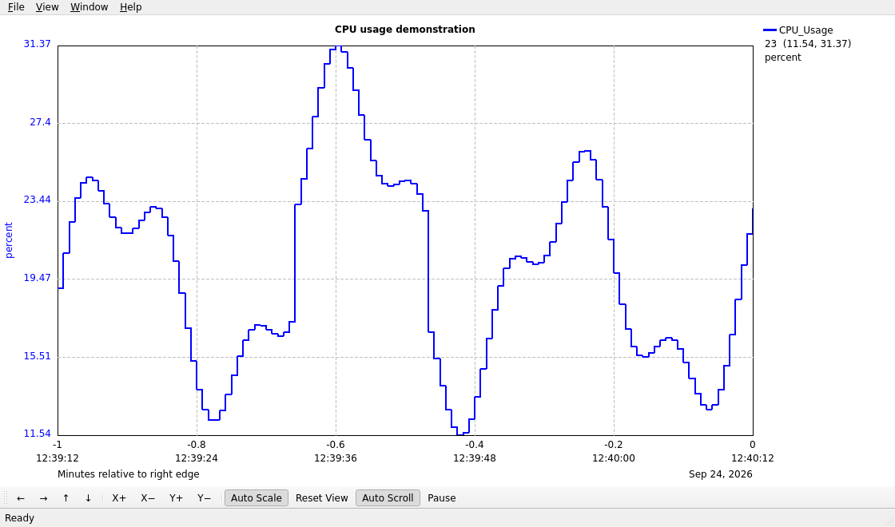

<div class="doc-eyebrow">EPICS TRENDING · QT 5 / QT 6</div>

# Qt StripTool documentation

<p class="doc-intro">Plot live process variables, inspect historical values, and carry your StripTool configurations into the Qt application.</p>

<figure class="doc-shot">
  
  <figcaption>The graph window with an illustrative CPU_Usage trace. The waveform is example data; the interface is captured from Qt StripTool.</figcaption>
</figure>

<div class="doc-paths">
  <a class="doc-path" href="./get-started/first-trend.html"><span class="path-number">01 / LEARN</span><strong>Plot your first PV →</strong><span>Start the application and connect a curve.</span></a>
  <a class="doc-path" href="./operate/graph.html"><span class="path-number">02 / OPERATE</span><strong>Explore the graph →</strong><span>Pan, zoom, read values, and annotate an event.</span></a>
  <a class="doc-path" href="./operate/files.html"><span class="path-number">03 / SAVE</span><strong>Keep and export data →</strong><span>Save configurations, export samples, and capture the plot.</span></a>
  <a class="doc-path" href="./reference/configuration.html"><span class="path-number">04 / LOOK UP</span><strong>Read the file format →</strong><span>Find command-line, environment, and configuration details.</span></a>
</div>

## Start trending

After [building Qt StripTool](./get-started/install), run the executable for your platform:

```sh
bin/Linux-x86_64/qtstriptool
```

The Controls window opens when no configuration is supplied. Enter a process variable, select **Connect**, and use the graph to see monitor updates. [Plot your first PV](./get-started/first-trend) walks through the controls and expected result.

<div class="doc-note"><strong>Using Motif StripTool today?</strong> Qt StripTool 1.0.0 is a normal release under its own executable name. Review the <a href="./understand/compatibility.html">known differences and rollout guide</a> when changing an operator launcher.</div>

## Find a task

- [Configure curves](./operate/curves) for limits, scaling, timing, colors, and the local CPU channel.
- [Read and navigate the graph](./operate/graph) for time labels, axes, cursor values, and annotations.
- [Retrieve historical data](./operate/history) from an EPICS Archiver Appliance.
- [Save and export](./operate/files) configuration, sample data, snapshots, and printed plots.

The [command-line reference](./reference/command-line), [environment variables](./reference/environment), and [configuration format](./reference/configuration) cover the exact inputs. The [appearance](./understand/appearance) and [performance](./understand/performance) notes describe engineering review and remaining release checks.
