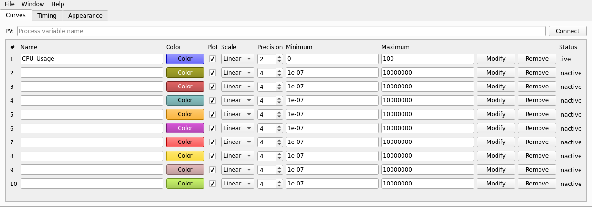
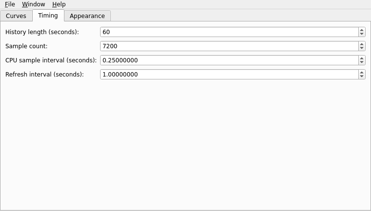
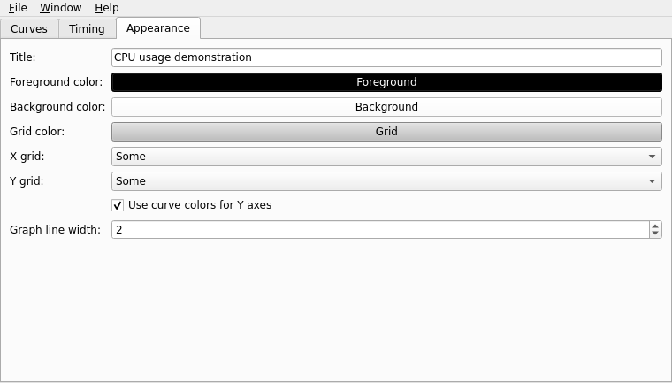

# Configure curves

Qt StripTool has ten curve slots. The graph and Controls windows use the same configuration, so edits in Controls affect acquisition and rendering immediately.

## Curve rows

Enter a name in an unused row or use the **PV** field and **Connect**. Each row controls plotting, linear or base-10 logarithmic scale, precision, minimum, maximum, and color. Select **Modify** to apply row edits. **Remove** frees the slot and stops acquisition.

<figure class="doc-shot">
  
  <figcaption>The Curves tab with the built-in CPU_Usage channel connected. The other nine slots are available for PVs.</figcaption>
</figure>

**Auto Scale** is graph-wide and fits every plotted curve to its visible data. **Reset View** returns curves to the limits shown in Controls. A curve added later follows the active mode. For log curves, choose positive limits; non-positive samples cannot appear on a base-10 axis and create a gap.

## Timing and appearance

The **Timing** tab sets history length, bounded sample count, the local `CPU_Usage` sampling interval, and a separate display refresh interval. Channel Access curves record monitor updates when delivered; their values are not resampled by that interval. `CPU_Usage` is a local pseudo-curve and does not open a Channel Access subscription.

<figure class="doc-shot doc-shot--medium">
  
  <figcaption>Timing settings in the Controls window.</figcaption>
</figure>

The **Appearance** tab sets graph colors, grid density, colored Y axes, and line width. Each curve has its own color. The graph uses step traces for both linear and logarithmic curves.

<figure class="doc-shot doc-shot--medium">
  
  <figcaption>Appearance settings in the Controls window.</figcaption>
</figure>

Settings supported by the legacy format are saved in `.stp` files. [Configuration files](../reference/configuration) lists the fields and current limits.
