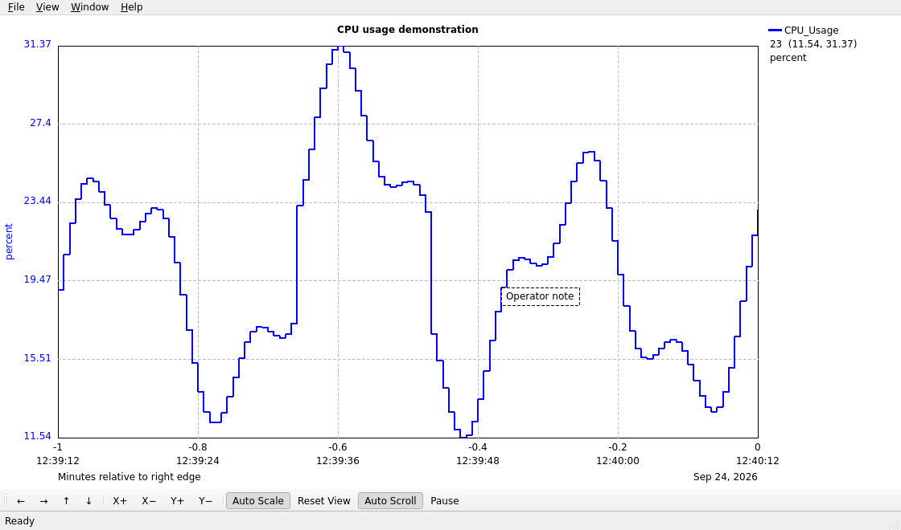

# Read and navigate the graph

The graph plots timestamped monitor values as step lines. A vertical axis can be colored for its curve; the legend beside the plot shows visible curve names and latest values.

## Read time and values

Each X-axis tick has relative minutes above local clock time. The rightmost relative label is zero; earlier ticks are negative. With auto-scroll enabled, the right edge follows the latest time. With auto-scroll off, it marks the end of the fixed visible range.

Move the pointer over the plot to update the location readout. Click a legend entry to read that curve's value at the pointer location.

## Navigate

The **View** menu can pause time scrolling, toggle auto-scroll, pan in time or value, zoom either axis, auto-scale, reset, clear data, and force a replot. The toolbar has arrows for panning, `X+`/`X−` for time zoom, and `Y+`/`Y−` for value zoom. Right click a toolbar Pan or Zoom button for a smaller step. Drag empty plot space with the left button to pan.

Vertical zoom uses logarithmic units for Log 10 curves. **Auto Scale** fits visible data; **Reset View** restores configured limits and the time view.

## Annotate an event

Right click the graph and choose **Annotate Here** to add a note at that time and value. Double click an annotation to edit it, or double click empty plot space to add one. Left click a box to select it; hold the middle button to move it. Delete or Backspace removes the selected annotation.

<figure class="doc-shot">
  
  <figcaption>An operator note on an illustrative trace. The dashed outline shows the selected annotation.</figcaption>
</figure>

Annotations are runtime graph state and are not saved in `.stp` files. Use [snapshot export](./files) if you need an image of the annotated plot.
