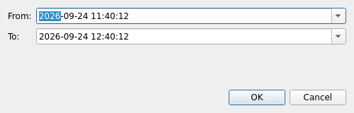

# Historical data

Choose **View > Historical Range** to request a time range from an EPICS Archiver Appliance. The result joins with live data on the graph. Requests are asynchronous and can be cancelled.

<figure class="doc-shot doc-shot--compact">
  
  <figcaption>Choose the start and end time before requesting archived samples.</figcaption>
</figure>

The default retrieval root is `http://asddtn03.aps4.anl.gov:17668/retrieval`. Set `QTSTRIPTOOL_ARCHIVER_URL` before launch to use another retrieval root or a `data/getData.json` endpoint. Long requests use automatic `lastSample` reduction. Numeric archived samples retain archive timestamps, status, and severity; archived strings and waveforms are ignored.

When a Channel Access PV is added, Qt StripTool also attempts a background request for the preceding five minutes. If that backfill is unavailable, live plotting continues. An explicit Historical Range request reports errors instead. The local `CPU_Usage` curve is live only and is not sent to the Archiver.

See [environment variables](../reference/environment) for the override and [compatibility](../understand/compatibility) for provider differences from Motif StripTool.
